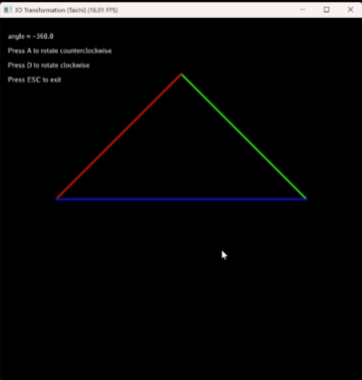
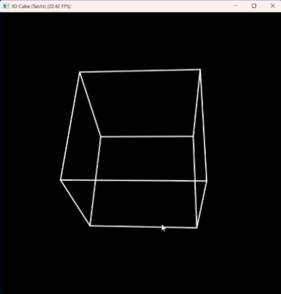

# taichi_mvp_lab：基于 Taichi 的三维变换与透视投影实验

## 一、项目简介

本项目是图形计算实验二作业，使用 Python 和 Taichi 完成了一个基础的三维变换与透视投影程序。整个实验围绕图形学中的 MVP 变换流程展开，包括模型变换、视图变换和投影变换三个核心部分，并在此基础上实现了图形的屏幕显示与键盘交互控制。

本项目包含必做题和选做题两部分。必做题 `main0.py` 实现了三角形的三维变换与旋转显示；选做题 `main1.py` 在此基础上进一步实现了立方体模型的透视显示与动态旋转。通过本次实验，我对三维图形从模型坐标到屏幕坐标的变换过程有了更直观的理解，也进一步熟悉了 Taichi 在图形程序开发中的基本使用方法。

---

## 二、项目结构

```text
taichi_mvp_lab/
├─ src/
│  └─ work1/
│     ├─ main0.py
│     └─ main1.py
├─ .gitignore
├─ .python-version
├─ README.md
├─ main.py
├─ pyproject.toml
└─ uv.lock
````

---

## 三、代码说明

### 1. `main0.py`

`main0.py` 为本次实验的必做题代码，主要完成三角形的三维变换与按键旋转显示。程序中首先定义了三角形的三个顶点坐标和三条边，然后分别构造模型矩阵、视图矩阵和投影矩阵，最后将三维顶点经过 MVP 变换后映射到二维屏幕坐标中进行绘制。

这一部分的主要实现内容包括：

* 定义三角形三个顶点
* 定义三条边及边的颜色
* 编写模型变换矩阵，实现三角形绕 Z 轴旋转
* 编写视图变换矩阵，实现观察点平移
* 编写透视投影矩阵，实现三维到二维的投影过程
* 完成齐次坐标变换与透视除法
* 通过 Taichi GUI 绘制三角形线框
* 监听键盘输入，实现按 `A` 键和 `D` 键旋转、按 `ESC` 键退出程序

### 2. `main1.py`

`main1.py` 为本次实验的选做题代码，主要完成立方体模型的透视显示与旋转交互。程序中定义了正方体的 8 个顶点和 12 条边，在保留原有视图变换和投影变换流程的基础上，通过组合绕 X 轴和绕 Y 轴的旋转矩阵，使正方体能够以更合理的角度显示在屏幕上。

这一部分的主要实现内容包括：

* 定义正方体的 8 个顶点坐标
* 定义正方体的 12 条边
* 编写绕 X 轴旋转矩阵
* 编写绕 Y 轴旋转矩阵
* 组合模型矩阵，使模型具有更明显的立体透视效果
* 完成顶点的齐次坐标变换与屏幕映射
* 使用 Taichi GUI 绘制正方体线框
* 监听键盘输入，实现正方体的动态旋转

### 3. `main.py`

项目根目录中的 `main.py` 为入口文件。实验的主要功能实现集中在 `src/work1/main0.py` 和 `src/work1/main1.py` 中。

---

## 四、功能说明

本项目实现了以下功能：

* 使用 Taichi 实现三维图形的 MVP 变换流程
* 实现三角形的透视投影显示
* 实现立方体模型的透视显示
* 支持模型绕坐标轴旋转
* 支持键盘交互控制图形旋转
* 支持在图形窗口中实时显示投影结果
* 支持按作业要求整理项目结构并上传至 GitHub

---

## 五、核心实现原理

### 1. 模型变换

模型变换用于控制模型本身的姿态。在必做题中，我通过绕 Z 轴的旋转矩阵实现三角形旋转。
在选做题中，我通过绕 X 轴和绕 Y 轴旋转矩阵的组合，实现正方体更自然的立体显示效果。

### 2. 视图变换

视图变换用于模拟观察者的位置变化。本实验中通过设置观察点 `eye_pos`，并对场景进行平移处理，将模型转换到观察空间中。

### 3. 投影变换

投影变换用于将三维场景映射到二维平面。本实验中使用透视投影矩阵进行处理，使远处物体显示得更小，从而形成符合视觉习惯的透视效果。

### 4. 齐次坐标与屏幕映射

程序将三维顶点扩展为四维齐次坐标，经过 `projection @ view @ model` 得到裁剪空间坐标，再进行透视除法，最后映射到 GUI 坐标系中完成绘制。

---

## 六、交互说明

### `main0.py`

* 按 `A` 键：三角形逆时针旋转
* 按 `D` 键：三角形顺时针旋转
* 按 `ESC` 键：退出程序

### `main1.py`

* 按 `A` 键：正方体向一个方向旋转
* 按 `D` 键：正方体向相反方向旋转
* 按 `ESC` 键：退出程序

---

## 七、效果展示

程序运行后会弹出图形窗口。

在 `main0.py` 中，窗口中显示一个彩色三角形，并支持通过按键进行旋转。

<p align="center">
  
</p>

在 `main1.py` 中，窗口中显示一个具有透视效果的白色线框正方体，并支持动态旋转观察。

<p align="center">
  
</p>

---

## 八、实验总结

通过本次实验，我完成了三维图形从模型坐标到屏幕坐标的完整变换流程实践，进一步理解了模型变换、视图变换和投影变换在图形学中的作用。必做题实现了三角形的透视显示与旋转，选做题进一步扩展实现了正方体线框模型的透视观察与动态旋转，较完整地体现了三维图形变换实验的核心内容。由此我深入理解了3D空间中的坐标变换流程。

````